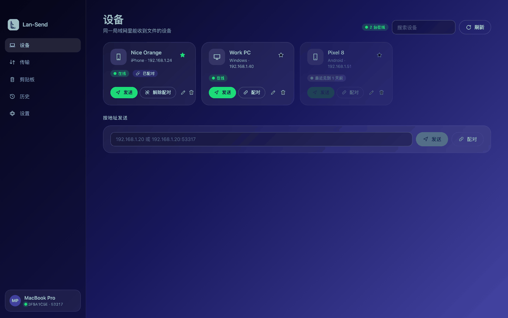
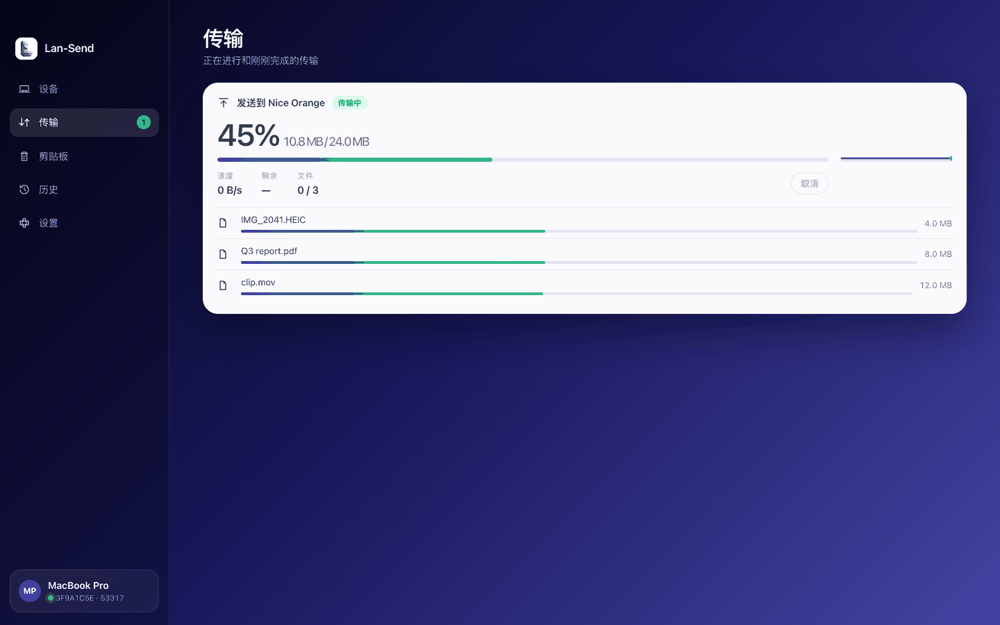
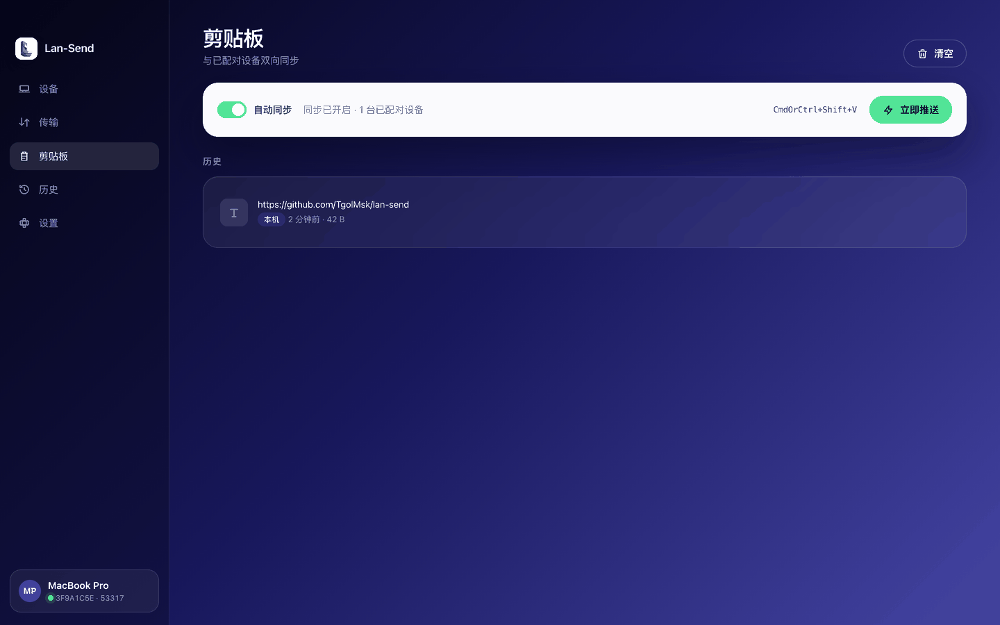
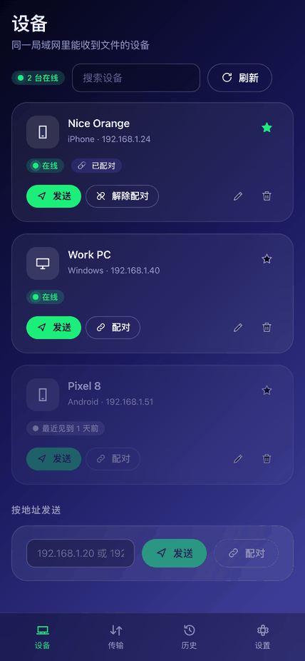
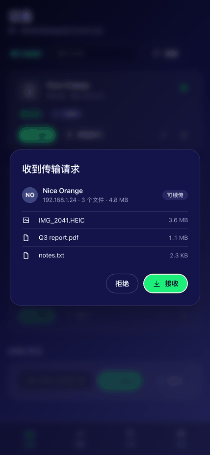
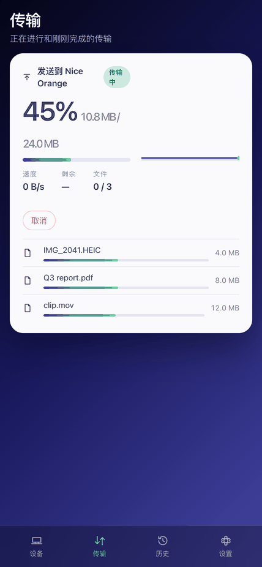
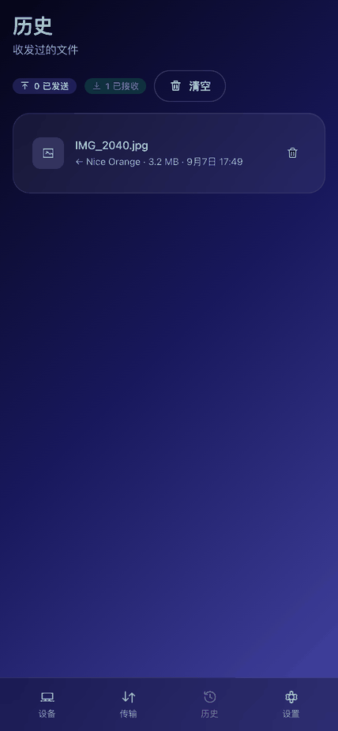
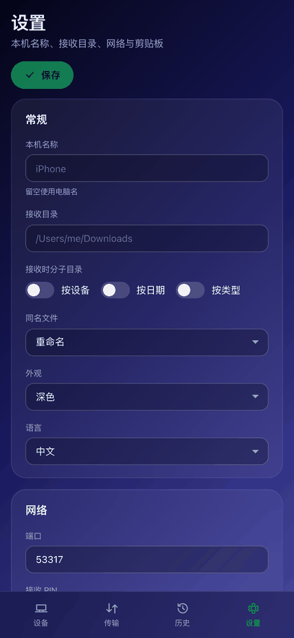

# lan-send

局域网文件与剪贴板互传工具，兼容 [LocalSend](https://localsend.org) 协议 v2.2，可与官方客户端互相发现、互相收发。
Rust 核心库 + Tauri 2 应用，目标平台 **macOS / Windows / iOS**。MIT 许可证。

> 状态：里程碑 1–3、5、6 完成——桌面应用（macOS / Windows）与命令行工具已在 Releases 发布；iOS 与 Mac App Store 沙盒版 0.2.0 已提交 App Store 审核。进度见 `CHANGELOG.md` 与 `CLAUDE.md`。

## 界面

<p align="center">
  
</p>

<p align="center">
  
  
</p>

<p align="center">
  
  
  
  
  
</p>

三端同一套界面：桌面端侧栏布局，iPhone 自动切换为底部标签栏，支持中英文与深浅色。更多截图（含 iPad、设置页）在 [`docs/screenshots/`](docs/screenshots/)，商店用的原尺寸截图由 `apps/app/scripts/store-screenshots.mjs` 生成。

## 特性

- 与官方 LocalSend 互通：UDP 组播发现、HTTPS 传输、PIN、SHA-256 校验。
- 私有扩展（官方客户端自动忽略）：断点续传、配对、剪贴板同步（文本 / 图片 / 文件列表）、媒体预览（计划）。
- 可靠性优先：流式传输不占内存、文件名净化、接收目录之外零写入、不收集遥测。

## 仓库布局

```
crates/core/    纯 Rust 核心库（无 GUI 依赖）
crates/cli/     命令行工具 lan-send（macOS / Windows）
apps/app/       Tauri 2 应用，一个工程覆盖 macOS / Windows / iOS
docs/           简报、接口清单、协议扩展、ADR、平台约束、UI 参考
tests/interop/  与官方 LocalSend 的互操作测试
```

详见 [`docs/adr/0001-repository-layout-and-targets.md`](docs/adr/0001-repository-layout-and-targets.md)。

## 下载安装

从 [Releases](https://github.com/TgolMsk/lan-send/releases) 下载：

- 应用（带界面）：macOS `lan-send-<版本>-macos-universal.dmg`，Windows `lan-send-<版本>-windows-x86_64-setup.exe`
- 命令行：macOS `lan-send-cli-<版本>-macos-universal.pkg`（装到 `/usr/local/bin`），Windows `lan-send-cli-<版本>-windows-x86_64.msi`（加入 PATH）
- 免安装：对应平台的 `.zip` / `.tar.gz`，校验和在 `SHA256SUMS.txt`
- iOS：App Store 审核中；内测通过 TestFlight 分发

安装包由 GitHub Actions 构建（`.github/workflows/release.yml`），打标签、签名与公证的配置见 [`docs/release.md`](docs/release.md)。

## 构建与使用

```bash
cargo build --workspace
cargo run -p lan-send-cli -- --help
```

```bash
lan-send discover                      # 列出局域网里的 LocalSend 设备
lan-send receive --dir ~/Downloads      # 前台接收，逐个请求确认（--auto-accept 免确认，--pin 123456 要求 PIN）
lan-send send "Nice Orange" a.jpg photos/ # 按别名、指纹前缀或 IP[:端口] 发送文件与文件夹
lan-send receive --organize device,type --on-conflict ask   # 按设备与类型分目录，同名时询问
lan-send history --limit 20            # 传输历史（--delete <id>，--clear）
lan-send pair "Nice Orange"            # 配对：两端显示同一校验码并确认（剪贴板同步的前提）
lan-send clip watch                    # 与所有已配对设备双向同步剪贴板（文本、图片）
lan-send clip push "Nice Orange"       # 把当前剪贴板推送一次
lan-send clip history --copy <id>      # 剪贴板历史，可重新复制、删除、清空
lan-send devices --favorite "Nice Orange"   # 已知设备、收藏、--unpair 解除配对
lan-send identity                      # 本机别名、指纹、配置目录
```

每次推送到 `main`，CI（`.github/workflows/ci.yml`）都会产出 Windows 与 macOS 的开发版 CLI artifact。

## 文档

- [`docs/dev-brief.md`](docs/dev-brief.md)：原始开发简报与修订记录
- [`docs/localsend-v2-interface-checklist.md`](docs/localsend-v2-interface-checklist.md)：官方协议与实现核对清单
- [`docs/protocol-extensions.md`](docs/protocol-extensions.md)：与官方实现的差异、私有扩展
- [`docs/platforms.md`](docs/platforms.md)：三端约束
- [`docs/ui-style-reference.md`](docs/ui-style-reference.md)：UI 视觉参考

## 致谢

协议来自 [LocalSend](https://github.com/localsend/localsend)（Apache-2.0）。本项目是独立实现，不复用其代码。
